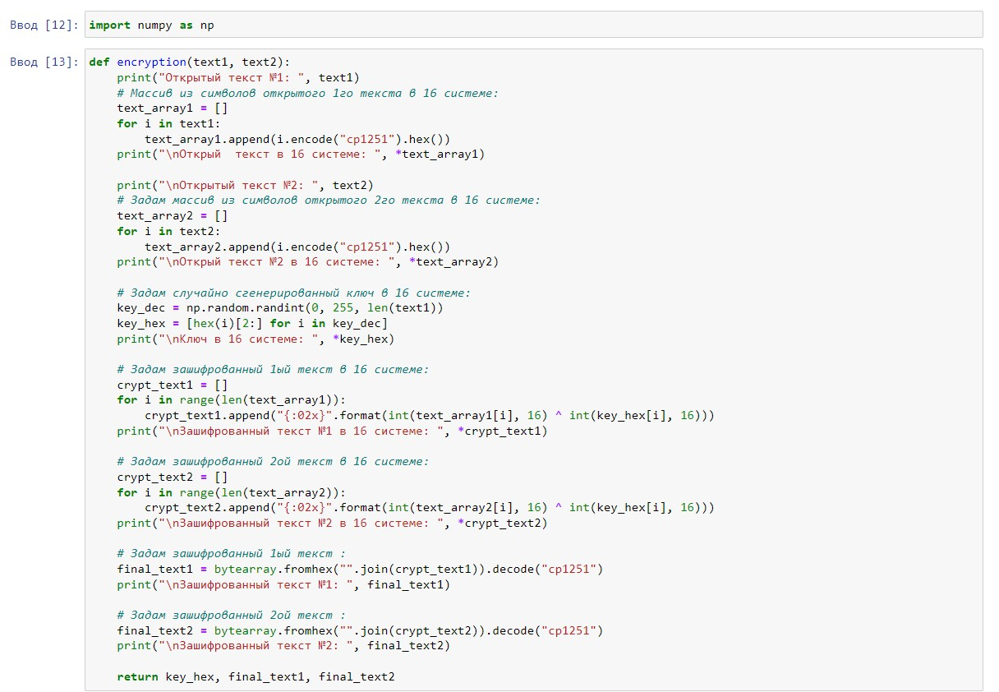

---
## Front matter
lang: ru-RU
title: Лабораторная работа №7
author: |
	Филиппова Вероника Сергеевна - студентка группы НКНбд-01-18
date: 11.12.2021

## Formatting
toc: false
slide_level: 2
theme: metropolis
header-includes:
 - \metroset{progressbar=frametitle,sectionpage=progressbar,numbering=fraction}
 - '\makeatletter'
 - '\beamer@ignorenonframefalse'
 - '\makeatother'
aspectratio: 43
section-titles: true
---

# Элементы криптографии. Однократное гаммирование Элементы криптографии. Шифрование (кодирование) различных исходных текстов одним ключом

## Цель выполнения лабораторной работы

Освоить на практике применение режима однократного гаммирования на примере кодирования различных исходных текстов одним ключом

## Задачи выполнения работы

1. Написать программу, которая должна определять вид шифротекстов при известных открытых текстах и при известном ключе.
2. Также эта программа должна определить вид одного из текстов, зная вид другого открытого текста и зашифрованный вид обоих текстов (т.е. не нужно использовать ключ при дешифровке).

## Результаты выполнения лабораторной работы. Часть 1

Написала функцию шифрования, которая определяет вид шифротекста при известном ключе и известных открытых текстах "НаВашисходящийот1204" и "ВСеверныйфилиалБанка".  

{ #fig:001 width=70% }

## Результаты выполнения лабораторной работы. Часть 2

Написала функцию дешифровки, которая определяет вид одного из текстов, зная вид другого открытого текста и зашифрованный вид обоих текстов

{ #fig:002 width=70% }
{ #fig:002 width=70% }

## Выводы

Освоила на практике применение режима однократного гаммирования на примере кодирования различных исходных текстов одним ключом.

