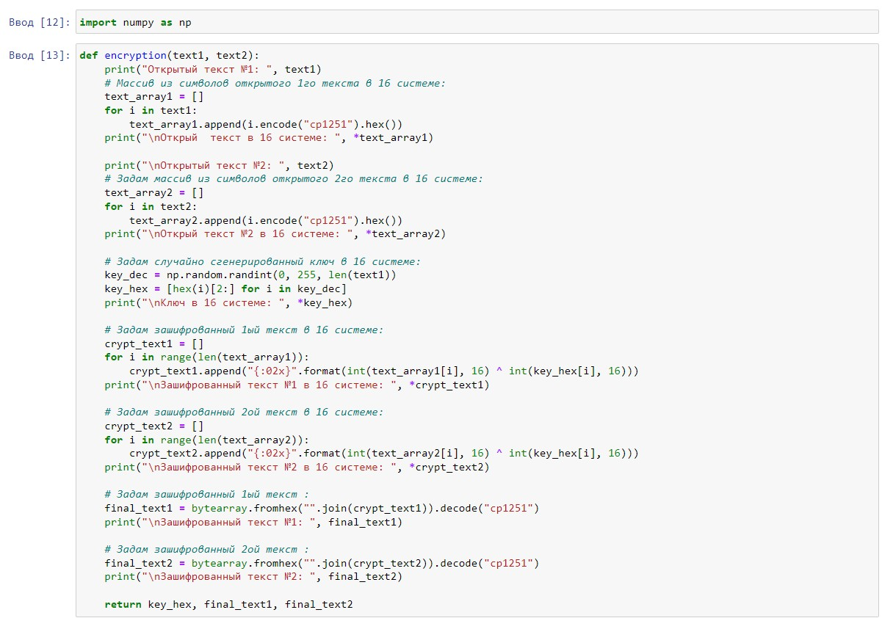
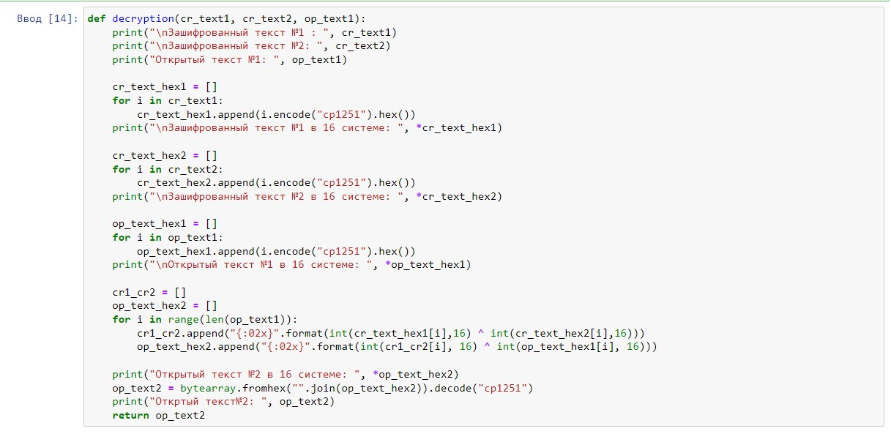
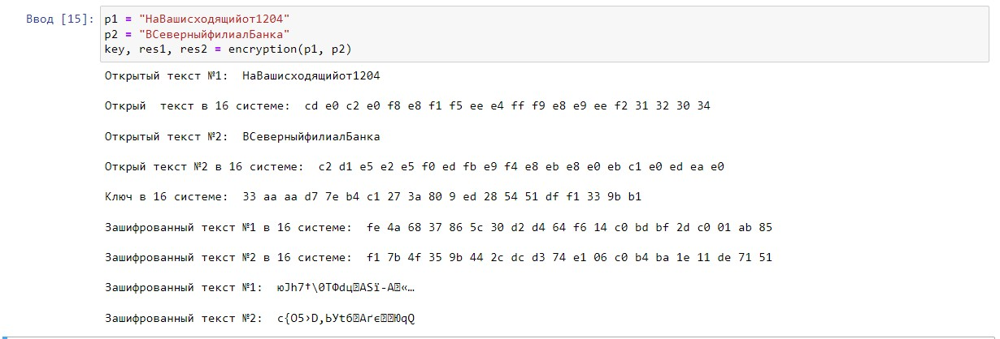
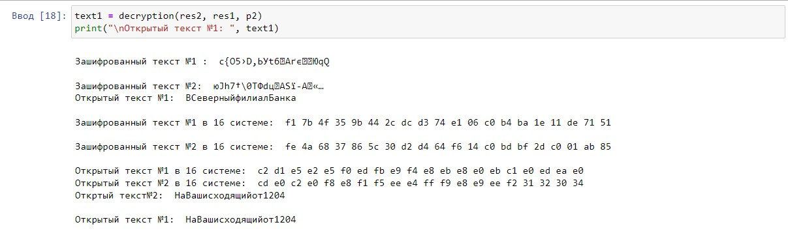
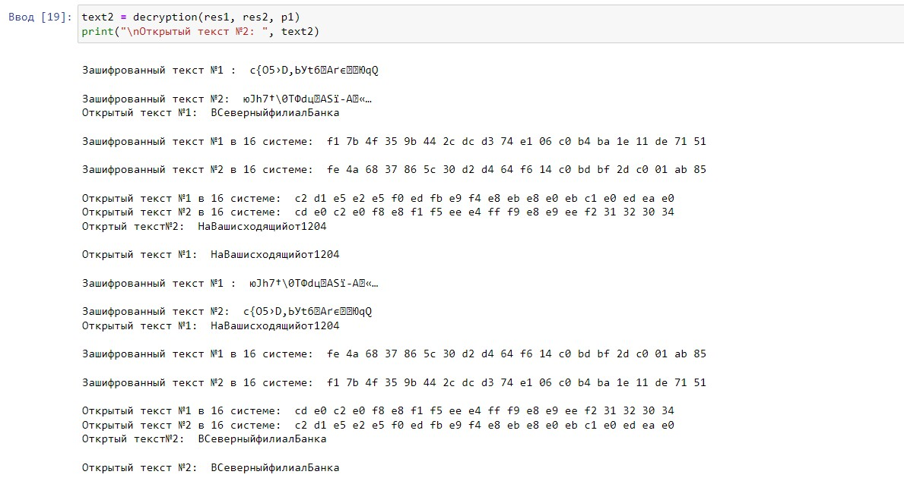

---
# Front matter
title: "Информационная безопасность."
subtitle: "Лабораторная работа №8."
author: "Филиппова Веорника Сергеевна."

# Generic otions
lang: ru-RU
toc-title: "Содержание"

# Bibliography

# Pdf output format
toc: true # Table of contents
toc_depth: 2
lof: true # List of figures
lot: true # List of tables
fontsize: 12pt
linestretch: 1.5
papersize: a4
documentclass: scrreprt
## I18n
polyglossia-lang:
  name: russian
  options:
  - spelling=modern
  - babelshorthands=true
polyglossia-otherlangs:
  name: english
### Fonts
mainfont: PT Serif
romanfont: PT Serif
sansfont: PT Sans
monofont: PT Mono
mainfontoptions: Ligatures=TeX
romanfontoptions: Ligatures=TeX
sansfontoptions: Ligatures=TeX,Scale=MatchLowercase
monofontoptions: Scale=MatchLowercase,Scale=0.9
## Biblatex
biblatex: true
biblio-style: "gost-numeric"
biblatexoptions:
  - parentracker=true
  - backend=biber
  - hyperref=auto
  - language=auto
  - autolang=other*
  - citestyle=gost-numeric
## Misc options
indent: true
header-includes:
  - \linepenalty=10 # the penalty added to the badness of each line within a paragraph (no associated penalty node) Increasing the value makes tex try to have fewer lines in the paragraph.
  - \interlinepenalty=0 # value of the penalty (node) added after each line of a paragraph.
  - \hyphenpenalty=50 # the penalty for line breaking at an automatically inserted hyphen
  - \exhyphenpenalty=50 # the penalty for line breaking at an explicit hyphen
  - \binoppenalty=700 # the penalty for breaking a line at a binary operator
  - \relpenalty=500 # the penalty for breaking a line at a relation
  - \clubpenalty=150 # extra penalty for breaking after first line of a paragraph
  - \widowpenalty=150 # extra penalty for breaking before last line of a paragraph
  - \displaywidowpenalty=50 # extra penalty for breaking before last line before a display math
  - \brokenpenalty=100 # extra penalty for page breaking after a hyphenated line
  - \predisplaypenalty=10000 # penalty for breaking before a display
  - \postdisplaypenalty=0 # penalty for breaking after a display
  - \floatingpenalty = 20000 # penalty for splitting an insertion (can only be split footnote in standard LaTeX)
  - \raggedbottom # or \flushbottom
  - \usepackage{float} # keep figures where there are in the text
  - \floatplacement{figure}{H} # keep figures where there are in the text
---

# Цель работы

Освоить на практике применение режима однократного гаммирования на примере кодирования различных исходных текстов одним ключом

# Задание
1. Написать программу, которая должна определять вид шифротекстов при известных открытых текстах и при известном ключе.
2. Также эта программа должна определить вид одного из текстов, зная вид другого открытого текста и зашифрованный вид обоих текстов (т.е. не нужно использовать ключ при дешифровке).

# Выполнение лабораторной работы

Написала функцию шифрования, которая определяет вид шифротекста при известном ключе и известных открытых текстах "НаВашисходящийот1204" и "ВСеверныйфилиалБанка". 

{ #fig:001 width=70% }

Написала функцию дешифровки, которая определяет вид одного из текстов, зная вид другого открытого текста и зашифрованный вид обоих текстов

{ #fig:002 width=70% }

Результат функции шифрования. 

{ #fig:004 width=70% }

Результат функции дешифрования.

{ #fig:005 width=70% }

{ #fig:005 width=70% }

# Ответы на вопросы

1. Не зная ключа, для определения одного из текстов, зная другой, необходимо воспользоваться формулой: $C_1 \oplus C_2 \oplus + P_1 = P_1 \oplus P_2 \oplus + P_1 = P_2$, где $C_1$ и $C_2$ - шифротексты.
2. При повторном использовании ключа при шифровании текста получим исходное сообщение
3. Режим шифрования однократного гаммирования одним ключом двух открытых текстов реализуется по формуле: $$C_1 = P_1 \oplus + K$$ $$C_2 = P_2 \oplus + K,$$ где $C_i$ - шифротексты, $P_i$ - открытые тексты, $K$ - единый ключ шифровки
4. Недостатки шифрования одним ключом двух открытых текстов:
	- Если одно из сообщений доступно в открытом виде и есть оба шифротекста, можно расшифровать каждое сообщение, не зная ключа.
	- Зная шаблон сообщений, есть возможность определить те символы сообщения $P_2$, которые находятся на позициях известного шаблона сообщения $P_1$.
7. Преимущества шифрования одним ключом двух открытых текстов:
	- Данный подход помогает упростить процесс шифрования и дешифровки. 
	- При отправке сообщений между двумя компьютерами, удобнее пользоваться одним общим ключом для передаваемых данных
	
# Выводы

Освоила на практике применение режима однократного гаммирования на примере кодирования различных исходных текстов одним ключом.